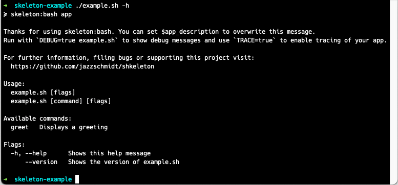
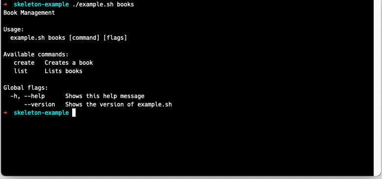

# skeleton:bash - Bash Script Framework

**skeleton:bash** is a small, declarative framework that aims at providing the look-and-feel of
any other *nix tool you and your users are used to.
It offers a convenient way to structure and organize your bash scripts and assists
you in writing versatile and easy-to-use programs.

Whats most important: it generates usage information for you and your scripts users.

## Features

**skeleton:bash** makes it easy to 
- [parse and validate flag and parameter options](#parsing-options)
- generate extensive usage information
- [write scripts with different sub commands](#adding-commands-and-subcommands)
- [setup and cleanup the environment](#helper-functions)
- [debug and trace your script](#debugging-and-tracing)

In addition to that, it offers functions to [colorize output and emit error messages](#helper-functions).  

## Examples
Suppose this executable (chmod +x) `example.sh`:

```bash
#!/usr/bin/env bash

source skeleton.sh

function @greet() {
  description "Displays a greeting"
  param "name" "n" "name" "greets <name> instead of the current user"; name="$param"

  execute() {
    echo "Hello ${name:-$(whoami)}"
  }
}
```

**Executing the greet command**

The **greet** command will receive the parameter `name|n` and also shows them when
running `./example.sh greet --help`.


Also, the **greet** command is listed in the global help page:



Instead of using named parameters, your commands can also be configured to receive
arguments:

```bash
function @greet() {
  description "Displays a greeting"
  args "NAME"

  execute() {
    echo "Hello ${1}"
  }

  help() {
    echo "Greets the given NAME"
  }
}
```

Since we added the `help` function, a help message other than the default description
tells the user that he can provide the **NAME** argument.


## Adding Commands and Subcommands

Every `@function` will be added as a command to your script. The script will fail, if
you don't provide a description. Nesting commands is a matter of renaming the command:

```bash
function @books() {
  description "Book Management"
}

function @books-list() {
  command "books list"
  description "Lists books"

  execute() {
    :
  }
}

function @books-create() {
  command "books create"
  description "Creates a book"

  execute() {
    :
  }
}
```



## Parsing Options

Defining options is pretty straightforward in **skeleton:bash**:
```bash
function @command {
    flag "s" "silent" "silences output"
    declare silent=$flag # true if either -s or --silent is present, false otherwise
    
    flag "v" "increases verbosity"
    declare verbose=$flag # only true, when -v is set; short and long args are interchangeable
    
    param "n" "name" "string" "sets the name"
    declare name=${param:-default} # the value of -n or --name or just 'default'
    # multiple values may be read with ${param[*]} or ${param[@]}
    
    param "max-age" "integer" "sets max-age"
    local max_age=${arg:-} # the value of --max-age if present

    # ...
}
```

Short options can be passed with the shorthand syntax `-abc`. If you provide an
option, that is not declared in your command an error message will be shown:


The global variables `$flag` and `$param` will hold the value directly after the
respective registering function has been called.

Options from command functions should be saved as global variables to remain usable
for the `execute` function like shown in the example above.

## Commands and special Functions

There are a few special functions:

|Function|Description|
|---|---|
|`setup`|Bootstraps the script, can be used to define global options|
|`teardown`|Will be called when the script exits|
|`main`|Will be called instead of usage page when script is being called without command |

*Notice*: When using the `teardown` function, it is necessary to call `__main` at the bottom
of your script!

### Helper Functions

|Function|Description|
|---|---|
|`error`|Emits red error messages to stderr along with its origin function name|
|`debug`|Logs an orange/brown debug message|
|`colorize`|Colorizes output; can also be used as pipe|
|`red`, `green`, `blue`, ...|*see above*|
|`has_flag`|Sets `$flag` to `true` when the flag option exists, false otherwise|
|`get_param`|Sets `$param` to the param values if present|
|`array_contains`|Returns `true` if the array `$2` contains `$1`|

## Debugging and Tracing

When called with `DEBUG` set to one of `1`, `true`, `yes` or `y`, debug messages
are shown and colorized. They are formatted like:

**`[DEBUG] <script-name> <command_function>: <message>`**

Since debugging of bash script can be pretty hard, you can also enable tracing by
supplying the `TRACE` parameter just like the debug parameter, which will enable
tracing as soon as the script enters your command.
